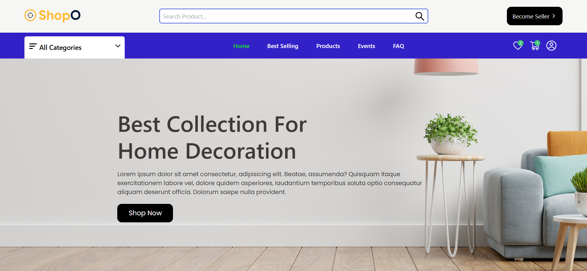

# 🛍️ ShopO – Multivendor E-commerce Platform

<!-- Add screenshots or a demo GIF here if available -->

## 📖 Description

**ShopO** is a full-featured multivendor e-commerce platform built using the **MERN stack** along with **Socket.io** and **Stripe** integration. It provides a robust marketplace experience where multiple sellers can manage their own products and orders, while buyers can seamlessly browse, purchase, and track items.

From real-time order updates to secure payment processing and seller dashboards, **ShopO** is built with scalability and performance in mind — ideal for anyone looking to build a professional e-commerce platform.

## 🧩 Features

- 🛒 **Multivendor support** with individual seller dashboards
- 🧑‍💼 Admin dashboard for managing users, products, and orders
- 🔄 **Real-time notifications** using Socket.io
- 💳 **Secure payments** via Stripe integration
- 🔐 User authentication and role-based access (buyer, seller, admin)
- 📦 Product management (CRUD operations, categories, inventory)
- 📝 Order and delivery tracking
- 🗂️ Cart, wishlist, and order history for customers
- 🌙 Light/Dark mode toggle
- 📱 Responsive design for all devices

## 🛠 Tech Stack

- **Frontend:** React, Redux Toolkit, Tailwind CSS, Axios, React Router
- **Backend:** Node.js, Express, MongoDB, Mongoose
- **Real-time:** Socket.io
- **Payments:** Stripe
- **Authentication:** JWT-based with role handling
- **Deployment:** (e.g., Vercel / Render / MongoDB Atlas)
